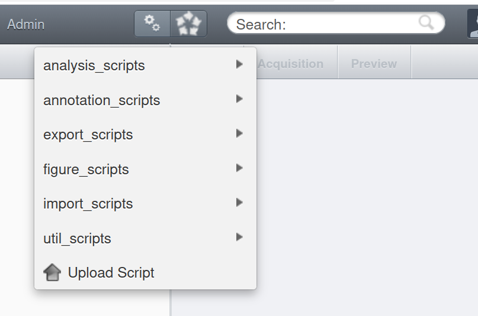
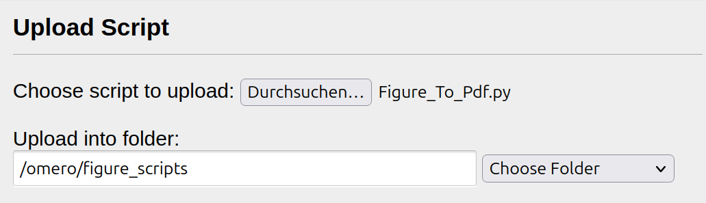

Getting a personal OMERO server up and running for testing!

# Goal 

Provide a very quick way for a dev to have an OMERO server running locally on a laptop.

After going through it, one should be able to: 

* Have a healthy server up locally

* Import a set of pre-selected, openly licensed, microscopy images via the CLI 

* Be able to browse these images using OMERO.web, OMERO.insights, OMERO.figure and ezomero


# Requirements 

This tutorial is written on Ubuntu 24, in a laptop with 16 GB RAM. 

It requires having Docker and Python 3.11 installed.    

Support for 3.11 ends on 2027-10, so if you are reading this text after that, you can be sure this is outdated :). 


# Basic steps 

## Get an OMERO running


While there are [many examples](https://github.com/ome/omero-deployment-examples) for deployment,  https://github.com/ome/docker-example-omero may be the easiest place to start.

```
gh repo clone https://github.com/ome/docker-example-omero

cd docker-example-omero
```

Then you will have an OMERO server running by going 

```
docker compose pull
docker compose up -d
```


You should see 
```
(.venv) ➜  docker-example-omero git:(master) docker compose up -d
[+] Running 3/3
 ✔ Container docker-example-omero-database-1     Running                                                                                                                                 0.0s 
 ✔ Container docker-example-omero-omeroweb-1     Running                                                                                                                                 0.0s 
 ✔ Container docker-example-omero-omeroserver-1  Running 
 ```

by running `docker ps`, you can see  something like 

```
(.venv) ➜  docker-example-omero git:(master) docker ps
CONTAINER ID   IMAGE                                   COMMAND                  CREATED          STATUS                  PORTS                                                             NAMES
c8bf3400dec8   openmicroscopy/omero-server:5           "/usr/local/bin/entr…"   58 minutes ago   Up 58 minutes           0.0.0.0:4063-4064->4063-4064/tcp, [::]:4063-4064->4063-4064/tcp   docker-example-omero-omeroserver-1
593788505a77   openmicroscopy/omero-web-standalone:5   "/usr/local/bin/entr…"   58 minutes ago   Up 58 minutes           0.0.0.0:4080->4080/tcp, [::]:4080->4080/tcp                       docker-example-omero-omeroweb-1
```

The users and passwords are all pre-configured to be "omero"

You should be able to access *OMERO.web*, a frontend to the server, at http://localhost:4080, using

user = "root"
password = "omero" 

## Get images into OMERO

Let's do this step using OMERO.py. First, cd back into your 'mini-omero' folder

``
cd ..
``

Now, create a virtual environment the way you prefer. 

You can go with `conda`, `uv`, `venv`, etc. 

Official docs go with conda (https://omero.readthedocs.io/en/stable/users/cli/installation.html), but I prefer uv. 

So first install uv if you do not have it:

```
curl -LsSf https://astral.sh/uv/install.sh | sh
```


```
uv venv --python 3.11 .venv && source .venv/bin/activate

# First, get the zeroc-ice dependence. You need to pull it from the glencoesoftware wheel, otherwise it gets too complex to build
uv pip install https://github.com/glencoesoftware/zeroc-ice-py-linux-x86_64/releases/download/20240202/zeroc_ice-3.6.5-cp311-cp311-manylinux_2_28_x86_64.whl

# Then, omero-py
uv pip install omero-py 

```

Now you should have the "omero" command available, and able to run to gain CLI access to your local server.

For that we will use the root passord:

```
omero login -s localhost:4064 -u root -w omero
```

You should get a success message like 

```
Created session for root@localhost:4064. Idle timeout: 10 min. Current group: system
```

Then you can simply run 

```
omero import sample_images
```

and get the images into your OMERO instance.

As a sanity check, you may go to *OMERO.web*, running at http://localhost:4080, and browse your files. 


And that is it! You now have a mini OMERO server with real-world samples to play with. 

# Extra

## Making figures with OMERO.figure 

OMERO.figure comes pre-bundled with the docker install. If you go to 

http://localhost:4080/figure/

You can use the features of OMERO.figure to start creating publication-quality features for the data on your server.

Say, you can select id "7" to start building a publication-quality figure with the image with id "7". 

You may notice that this basic installation comes with OMERO.figure, but it does not come with the "export" option on top. It will look greyed out. 

On the scripts folder, you will find a copy of 
https://github.com/ome/omero-figure/blob/master/omero_figure/scripts/omero/figure_scripts/Figure_To_Pdf.py


To install it, go to http://localhost:4080/  and click on the "Upload Script" button: 



then select the 


## Browsing with OMERO.insights 

TBD

## Browsing with ezomero

TBD